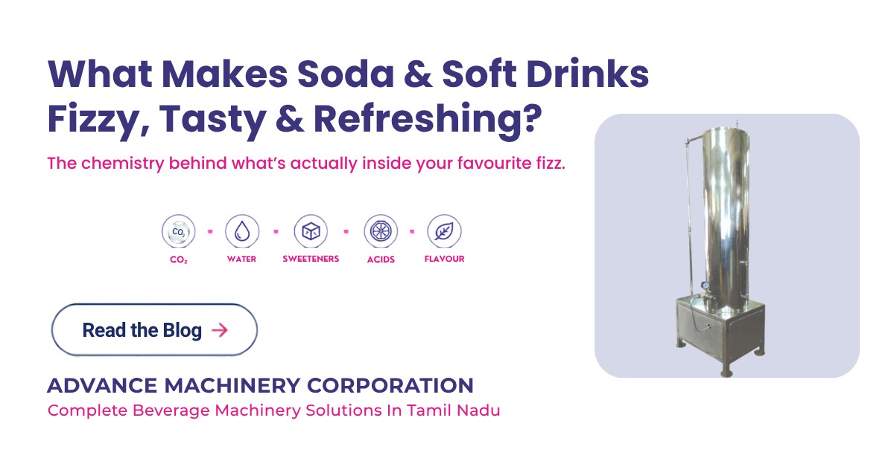

# amc-softdrink-machinery
Information and resources about soft drink and carbonated beverage machinery, carbonation, filling, capping and beverage manufacturing.

# Carbonated Beverage Manufacturing and Soft Drink Machinery

A practical resource exploring the ingredients, carbonation process and manufacturing considerations behind carbonated beverages, including soft drinks, soda and sparkling beverages.

This repository contains an educational article explaining what gives carbonated drinks their fizz, taste and characteristic bite, along with an introduction to the manufacturing processes involved in producing and packaging carbonated beverages.

## What Gives Carbonated Drinks Their Fizz, Taste and Bite?
When you open a chilled bottle of soda, soft drink, sparkling water or any other carbonated beverage, the familiar hiss and burst of bubbles are easy to recognize. But what actually creates that experience?

A carbonated drink is a carefully formulated combination of water, dissolved carbon dioxide, sweeteners, acids and flavoring ingredients. Each component contributes something different to the final taste, appearance and sensory experience.

## The Role of Carbon Dioxide in Carbonated Drinks

Carbon dioxide (CO₂) is what gives a carbonated beverage its characteristic fizz. During carbonation, CO₂ is dissolved into the liquid under controlled pressure.

When the bottle or can is opened, the pressure inside the container drops. The dissolved gas begins to escape from the liquid, forming the bubbles we see.

CO₂ also contributes to the distinctive sharp or tingling sensation associated with carbonated drinks. This makes carbonation more than a visual feature—it is an important part of the drinking experience.

## Water Forms the Base of the Beverage

Water is the primary ingredient in most soft drinks and provides the foundation in which the other ingredients are blended and dissolved.

For beverage production, water quality is therefore important. Proper treatment and filtration help maintain consistency in taste and support the required quality standards before water moves into subsequent processing stages.

## Sweeteners and Acids Create the Balance

Sweeteners provide the desired level of sweetness, while food acids help balance that sweetness and contribute to the characteristic tartness of many soft drinks.

Depending on the product, manufacturers may use ingredients such as sugar, fruit-based sweeteners or high-intensity sweeteners. Common food acids include citric acid, malic acid and phosphoric acid.

The formulation needs to be carefully balanced because sweetness and acidity significantly influence the final taste profile.

## Flavors and Colors Define the Product

Flavoring ingredients give each beverage its distinctive identity. Fruit, cola, citrus and other flavor profiles are created by combining selected flavor compounds in specific proportions.

Color also influences how consumers perceive a drink. The appearance of the beverage creates an expectation before the first sip, making color an important part of product presentation.

## How Does Beverage Chemistry Connect to Manufacturing?

Creating the right formulation is only one part of producing a consistent carbonated beverage. The product must also move through carbonation, filling, capping and packaging under suitable process conditions.

This is where beverage manufacturing equipment becomes important. The carbonator needs to introduce CO₂ effectively, while the filling system must handle the carbonated product appropriately for the selected container.

AMC's existing machinery range includes [Soda/Soft Drink Machines for Glass Bottles](https://advancemachineryindia.com/our-products/soda-soft-drink-machines-for-glass-bottles/) and Soda/Soft Drink Machines for PET Bottles, along with carbonators and capping solutions for different production requirements.

## From Ingredients to the Finished Bottle

The fizz in a carbonated drink may seem simple when you hear the bottle open, but the finished product represents several carefully controlled stages.

Water provides the base. Sweeteners and acids establish the taste balance. Flavors and colors create the product identity. CO₂ delivers the characteristic carbonation.

Together, these elements create the drink consumers recognize. Behind that familiar bottle is a combination of food formulation, carbonation technology and precision machinery working together to deliver a consistent product.

For beverage manufacturers, understanding what is inside the drink is only the beginning. Understanding how each stage is controlled is what turns a formulation into a finished product.
